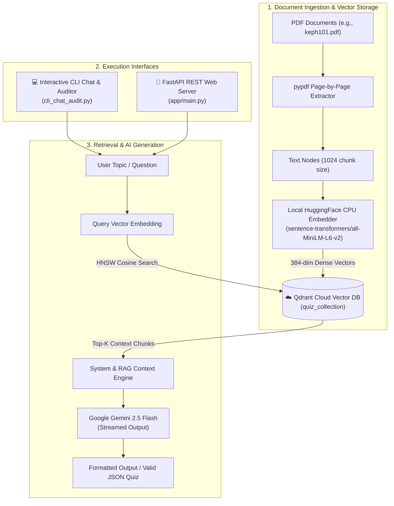

# 🧠 Quiz RAG Backend & Live Streaming Financial Auditor

An enterprise-grade, high-concurrency Retrieval-Augmented Generation (RAG) system built with **FastAPI**, **LlamaIndex**, **Qdrant Cloud Vector Database**, and **Google Gemini 2.5 Flash**.

This system allows you to index educational documents (PDFs, textbooks, study materials) into a managed cloud vector store, run low-latency semantic search, stream quiz generations with sub-second Time-to-First-Token (TTFT), and track token consumption and financial costs in real-time (in both **USD** and **INR ₹**).

---

## 🏗️ High-Level System Architecture



---

## ⚡ Core Highlights & Features

1. **☁️ Qdrant Cloud Vector Database**:
   - Stores 384-dimensional dense vectors with HNSW cosine similarity search.
   - Dual **sync (`QdrantClient`)** and **async (`AsyncQdrantClient`)** connections for non-blocking CLI streaming and high-concurrency FastAPI requests.
   - Automatic collection creation and remote persistent storage.

2. **🤖 Google Gemini 2.5 Flash**:
   - Official Google GenAI unified SDK (`gemini-2.5-flash`).
   - High speed and generous quota tier compared to preview/deprecated models.

3. **💸 Real-Time Financial Token Auditor**:
   - Live token counting per interaction turn and cumulative session totals.
   - Dynamic pricing calculations based on official rates:
     - **Input**: $0.0750 per 1M tokens (~₹6.45 INR)
     - **Output**: $0.3000 per 1M tokens (~₹25.80 INR)
     - Exchange Rate: 1 USD = ₹86.00 INR.

4. **⚡ Live Token Streaming (Typewriter Effect)**:
   - Tokens stream directly to stdout as they are generated by Gemini.
   - Instant response feel with Time-to-First-Token (TTFT) profiling (~350–500ms).

5. **🛡️ Production FastAPI Backend**:
   - In-memory TTL caching (15-minute validity) serving repeated quiz queries in `<2ms`.
   - Concurrency-limiting semaphore (`MAX_CONCURRENT_LLM_CALLS = 30`) protecting downstream LLM rate limits.
   - Dynamic PDF upload and indexing endpoint (`/upload-document/`).
   - Real-time vector store health status endpoint (`/vector-db-status/`).

---

## 📋 Prerequisites

- **Python**: Version `3.10` or higher (`3.11` recommended)
- **Package Manager**: [`uv`](https://github.com/astral-sh/uv) (recommended for blazing speed) or standard `pip`
- **Google Gemini API Key**: Free API key from [Google AI Studio](https://aistudio.google.com/app/apikey)
- **Qdrant Cloud Cluster**: Free cluster from [Qdrant Cloud](https://cloud.qdrant.io/) (URL & API Key)

---

## 🚀 How to Run for the First Time (Step-by-Step)

### Step 1: Clone or Navigate to the Project

```powershell
cd d:\Personal\AI-QUIZ\quiz-rag-backend
```

---

### Step 2: Create and Activate Virtual Environment

**Using PowerShell (Windows):**
```powershell
# Create virtual environment if not already created
python -m venv .venv

# Activate virtual environment
.\.venv\Scripts\Activate.ps1
```

*(On macOS / Linux, use `source .venv/bin/activate`)*

---

### Step 3: Install Dependencies

Using `uv` (super fast):
```powershell
uv pip install -r pyproject.toml
```

Or using standard `pip`:
```powershell
pip install -e .
```

Key packages installed: `fastapi`, `uvicorn`, `llama-index`, `qdrant-client`, `llama-index-vector-stores-qdrant`, `google-genai`, `sentence-transformers`, `pypdf`, `rich`.

---

### Step 4: Configure Environment Variables (`.env`)

Create a `.env` file in the project root (you can copy `.env.example`):

```env
# 1. Google Gemini API Key
GOOGLE_API_KEY=your_gemini_api_key_here

# 2. Qdrant Cloud Vector Database
QDRANT_URL=https://your-cluster-id.eu-west-1-0.aws.cloud.qdrant.io:6333
QDRANT_API_KEY=your_qdrant_api_key_here
QDRANT_COLLECTION_NAME=quiz_collection

# 3. Optional HuggingFace Token (if needed)
HF_TOKEN=your_hf_token_here
```

> **Security Note:** `.env` is listed in `.gitignore` and will never be committed to git.

---

### Step 5: Run the Interactive CLI Chat & Financial Auditor

Launch the interactive CLI terminal to chat with your documents, test streaming, and monitor token costs:

```powershell
python cli_chat_audit.py
```

**Options & Flags:**
```powershell
# Run with custom model
python cli_chat_audit.py --model gemini-2.5-flash

# Toggle RAG retrieval (true/false)
python cli_chat_audit.py --rag true

# Adjust number of retrieved chunks
python cli_chat_audit.py --top-k 5

# Disable financial audit table for a minimal view
python cli_chat_audit.py --audit false
```

**Interactive In-Chat Commands:**
- `audit` — Toggle real-time audit tables ON / OFF.
- `sources` — Inspect the exact document text chunks retrieved for your last question.
- `clear` — Clear the terminal screen.
- `exit` — Exit session and display the final financial audit report.

---

### Step 6: Run the FastAPI Web Server

Start the REST API server with live reloading:

```powershell
python -m uvicorn app.main:app --reload --host 0.0.0.0 --port 8000
```
*(Or simply execute `python app/main.py`)*

Once started:
- **Interactive Swagger Docs**: [http://localhost:8000/docs](http://localhost:8000/docs)
- **ReDoc Documentation**: [http://localhost:8000/redoc](http://localhost:8000/redoc)

---

## 📡 REST API Reference

### 1. Vector Database Health Check
- **Endpoint**: `GET /vector-db-status/`
- **Description**: Returns live connection status, active collection name, points count, and cluster URL.
- **Example Response**:
```json
{
  "status": "healthy",
  "vector_database": {
    "type": "Qdrant Cloud",
    "collection": "quiz_collection",
    "points_count": 15,
    "status": "green",
    "cluster_url": "https://your-cluster.cloud.qdrant.io:6333"
  }
}
```

---

### 2. Upload and Index Document
- **Endpoint**: `POST /upload-document/`
- **Content-Type**: `multipart/form-data`
- **Body**: `file` (PDF document)
- **Description**: Parses PDF page-by-page, chunks text, generates embeddings, and uploads points directly to Qdrant Cloud.
- **Example Response**:
```json
{
  "message": "Successfully uploaded and indexed sample.pdf",
  "chunks_added": 12
}
```

---

### 3. Generate Multiple-Choice Quiz
- **Endpoint**: `POST /generate-quiz/`
- **Content-Type**: `application/json`
- **Request Body**:
```json
{
  "topic": "UNITS AND MEASUREMENT",
  "num_questions": 3,
  "refresh": false
}
```
- **Example Response**:
```json
{
  "status": "success",
  "source": "generated",
  "data": [
    {
      "question": "What defines a 'unit' in the context of physical measurement?",
      "options": [
        "A numerical value that accompanies a measurement.",
        "A basic, arbitrarily chosen, and internationally accepted reference standard.",
        "A combination of base quantities used to form derived quantities.",
        "A system of measurement adopted by various countries."
      ],
      "correct_answer": "A basic, arbitrarily chosen, and internationally accepted reference standard.",
      "explanation": "Measurement of any physical quantity involves comparison with a certain basic, arbitrarily chosen, internationally accepted reference standard called unit."
    }
  ]
}
```

---

## 📬 Postman Testing

A ready-to-import Postman collection is included in the root directory:
- [postman_collection.json](postman_collection.json)

**Import Instructions:**
1. Open Postman ➔ Click **Import**.
2. Drag and drop `postman_collection.json`.
3. The collection provides pre-configured requests for:
   - `1. Upload Document`
   - `2. Generate Quiz`
   - `3. Vector DB Status`

---

## 📂 Project Directory Structure

```text
quiz-rag-backend/
├── app/
│   ├── api/
│   │   └── routes.py           # FastAPI REST endpoints & caching logic
│   ├── core/
│   │   └── engine.py           # Qdrant Cloud + LlamaIndex RAG engine
│   ├── schemas/
│   │   └── quiz.py             # Pydantic request models
│   └── main.py                 # FastAPI application & lifespan management
├── cli_chat_audit.py           # Rich CLI interactive chat & token financial auditor
├── data/                       # Local raw document files (e.g. keph101.pdf)
├── doc/
│   └── INFORMATION_FLOW.md     # Detailed architecture & Mermaid flowcharts
├── postman_collection.json     # Postman collection for API testing
├── pyproject.toml              # Dependencies & project metadata
├── token_cost_audit.py         # Standalone pricing audit script
├── .env.example                # Template for environment variables
└── README.md                   # Project documentation & first-time run guide
```

---

## 🛠️ Common Troubleshooting & FAQs

### Q1: `UnicodeEncodeError: 'charmap' codec can't encode character` on Windows
Windows PowerShell defaults to code page 1252. Set Python's I/O encoding to UTF-8:
```powershell
$env:PYTHONIOENCODING="utf-8"
python cli_chat_audit.py
```

### Q2: Gemini Quota Exceeded (HTTP 429)
The experimental `gemini-3.5-flash` model has a strict free-tier daily cap (20 requests/day). This project defaults to `gemini-2.5-flash` which has significantly higher quota limits.

### Q3: `Async client is not initialized!`
When using `QdrantVectorStore` with FastAPI async endpoints (`aquery()`), both synchronous `QdrantClient` and `AsyncQdrantClient` are automatically configured in `app/core/engine.py`.

---

## 📄 License
This project is proprietary and built for high-performance AI education and quiz generation applications.
