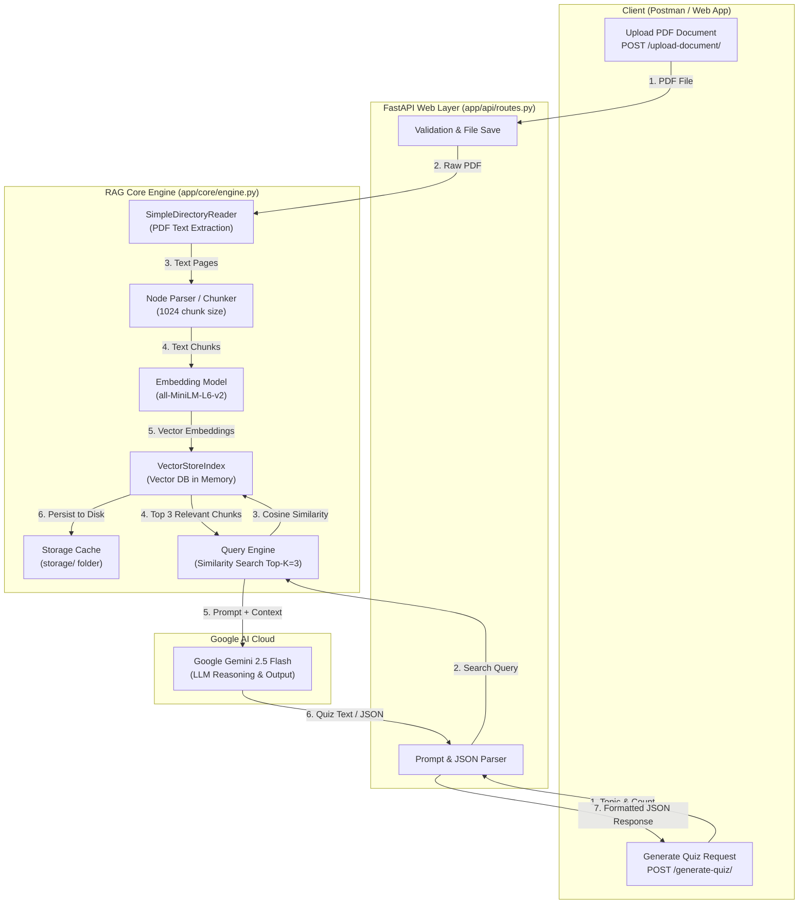
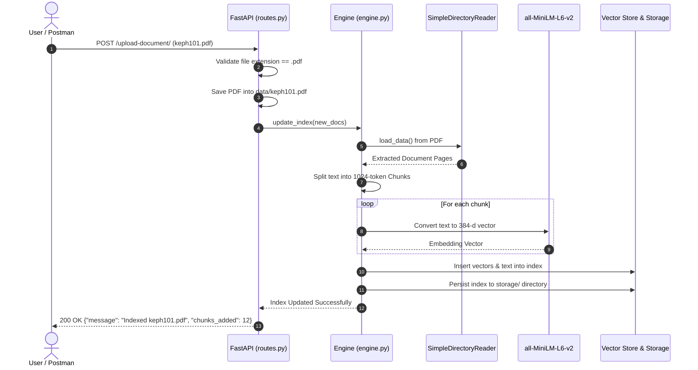
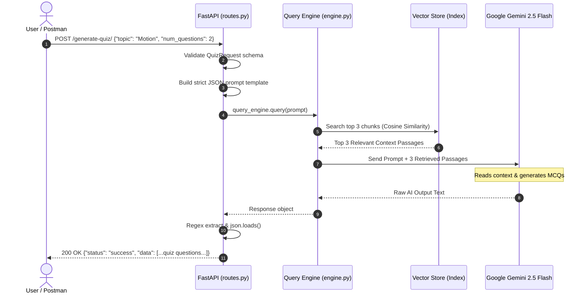

# 📚 RAG System Architecture & End-to-End Workflow Documentation

Is document me hum detail me samjhenge ki:
1. **Jab user PDF document upload karta hai**, to backend me internally kya-kya steps hote hain (Document Ingestion & Indexing Flow).
2. **Jab user quiz ya sawal puchhta hai**, to backend relevant context kaise dhoondhta hai aur AI se quiz JSON kaise generate karwata hai (Retrieval & Generation Flow).

---

## 🏗️ 1. Overall System Architecture



---

## 📤 2. FLOW 1: Jab Ham Document Upload Karte Hain

### 📝 Step-by-Step Explanation:

1. **Client Request (`POST /upload-document/`)**:
   - Client PDF file ko `multipart/form-data` ke roop me bhejta hai.
   - Example: `file: "keph101.pdf"`

2. **File Validation & Disk Storage**:
   - FastAPI check karta hai ki file ka extension `.pdf` hai ya nahi.
   - File ko binary format me server ke [`data/`](file:///d:/Personal/AI-QUIZ/quiz-rag-backend/data) folder me save kiya jata hai.

3. **Text Extraction (PDF Parsing)**:
   - LlamaIndex ka `SimpleDirectoryReader` PDF ko read karta hai aur har page ka raw text extract karta hai.

4. **Chunking / Node Splitting**:
   - Pure document ka text ek sath AI ko nahi bheja ja sakta, isliye LlamaIndex us text ko chhote-chhote hisson (**Nodes / Chunks**) me todta hai.
   - **Chunk Size**: `1024 tokens` (lagbhag 700–800 words)
   - **Chunk Overlap**: `100 tokens` (taaki do sentences ke beech context break na ho)

5. **Vector Embedding Generation**:
   - Local Embedding Model (`sentence-transformers/all-MiniLM-L6-v2`) har chunk ko dense numbers ke ek array (**384-dimensional vector**) me convert karta hai.
   - Yeh vector text ke *meaning* (semantic concept) ko capture karta hai.

6. **Vector Indexing & Disk Persistence**:
   - Vectors aur unke text chunks ko in-memory `VectorStoreIndex` me add kiya jata hai.
   - Saath hi ye data [`storage/`](file:///d:/Personal/AI-QUIZ/quiz-rag-backend/storage) directory me save ho jata hai (`docstore.json`, `index_store.json`, etc.).
   - Iska fayda yeh hai ki dubara server restart hone par poori PDF ko re-index nahi karna padta, balki 0.1 second me disk se cache load ho jata hai.

7. **Success Response**:
   - Client ko kitne chunks index hue uska confirmation milta hai.

### 📊 Document Upload Sequence Diagram:



### 📥 Example API Request & Response (Upload):
- **Request**:
  - `POST http://localhost:8000/upload-document/`
  - Body (`form-data`): `file: keph101.pdf`
- **Response**:
  ```json
  {
    "message": "Successfully uploaded and indexed keph101.pdf",
    "chunks_added": 12
  }
  ```

---

## 🧠 3. FLOW 2: Jab Ham Kuchh Puchhte / Quiz Generate Karte Hain

### 📝 Step-by-Step Explanation:

1. **Client Request (`POST /generate-quiz/`)**:
   - User JSON body me topic aur number of questions bhejta hai:
     ```json
     {
       "topic": "Newton's Laws of Motion",
       "num_questions": 3
     }
     ```

2. **Pydantic Validation**:
   - [`QuizRequest`](file:///d:/Personal/AI-QUIZ/quiz-rag-backend/app/schemas/quiz.py) schema check karta hai ki `topic` string hai aur `num_questions` integer hai (default: 5).

3. **Prompt Construction**:
   - Backend ek specialized prompt ready karta hai jo AI ko strictly PDF context par stick rehne aur clean JSON format me answer karne ka instruction deta hai.

4. **Semantic Retrieval (Similarity Search)**:
   - Query Engine user ke topic ko vector me convert karta hai.
   - Vector Store me **Cosine Similarity Search** chalta hai.
   - Uploaded PDF ke hazaron lines me se sirf **Top 3 most relevant chunks** nikal kar aate hain (`similarity_top_k=3`).

5. **Context Augmentation (RAG Step)**:
   - Top 3 retrieved chunks ko prompt ke sath attach karke ek complete query banayi jaati hai:
     > *"Here is the context from the document: [...retrieved chunks...]. Based ONLY on this, generate 3 MCQs on 'Newton's Laws of Motion' in JSON format."*

6. **LLM Generation (Google Gemini 2.5 Flash)**:
   - Augmented prompt Google Gemini API ko bheja jata hai.
   - Gemini context ko padh kar multiple-choice questions, options, correct answer, aur explanation generate karta hai.

7. **JSON Regex Extraction & Cleaning**:
   - Backend Gemini ke raw text response me se regex `\[.*\]` ke zariye valid JSON array extract karta hai.
   - Isse agar model ne koi extra baatein likhi hon to wo clean ho jaati hain.

8. **Final JSON Response**:
   - Parsed JSON client ko return ho jata hai, jise frontend seedha Quiz UI me render kar sakta hai.

### 📊 Quiz Generation Sequence Diagram:



### 📥 Example API Request & Response (Generate Quiz):

- **Request**:
  - `POST http://localhost:8000/generate-quiz/`
  - Headers: `Content-Type: application/json`
  - Body:
    ```json
    {
      "topic": "Kinematics",
      "num_questions": 2
    }
    ```

- **Output Response**:
  ```json
  {
    "status": "success",
    "data": [
      {
        "question": "What is the SI unit of acceleration?",
        "options": [
          "m/s",
          "m/s^2",
          "km/h",
          "Newton"
        ],
        "correct_answer": "m/s^2",
        "explanation": "Acceleration is defined as the rate of change of velocity per unit time, whose SI unit is meters per second squared (m/s^2)."
      },
      {
        "question": "In uniform circular motion, which of the following remains constant?",
        "options": [
          "Velocity",
          "Acceleration",
          "Speed",
          "Displacement"
        ],
        "correct_answer": "Speed",
        "explanation": "In uniform circular motion, the direction of motion continuously changes so velocity changes, but the magnitude of velocity (speed) remains constant."
      }
    ]
  }
  ```

---

## ⚡ 4. Key Performance Optimizations in this Project

| Problem | Pehle Kya Ho Raha Tha | Hamne Kaise Solve Kiya |
| :--- | :--- | :--- |
| **Model Size** | Meta Llama-2-7b (~13 GB) download aur CPU par crash ho raha tha | **Google Gemini 2.5 Flash API** lagaya jo 0 MB local RAM leta hai aur 1 sec me answer deta hai |
| **Startup Freeze** | Server restart hone par poori PDF ko bar-bar embed karta tha (minutes lagte the) | **Disk Storage (`storage/`) cache** banaya — ab startup sirf **0.1 second** leta hai |
| **Embedding Quota Limits** | Gemini Embedding par 429 Rate limit / Quota Exhaust error aa raha tha | Local **`sentence-transformers/all-MiniLM-L6-v2`** lagaya jo 100% free, lightweight (80MB) aur unlimited hai |
| **JSON Output Consistency** | LLM random text ya markdown likh deta tha | Prompt engineering + regex pattern matching `re.search(r'\[.*\]', raw_output)` lagaya |
