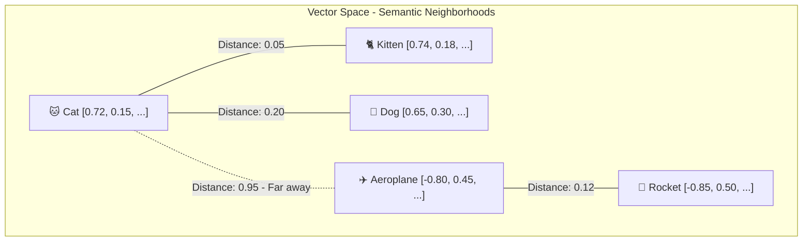
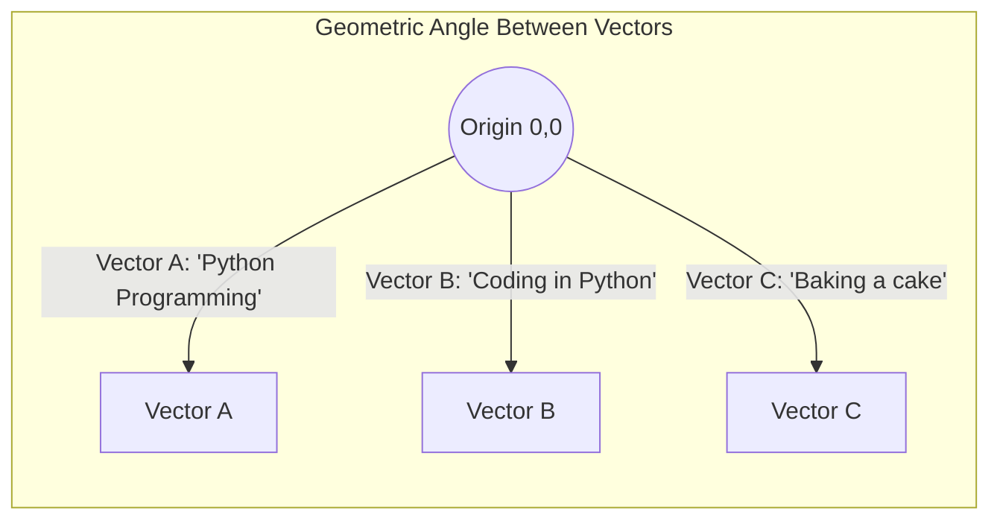
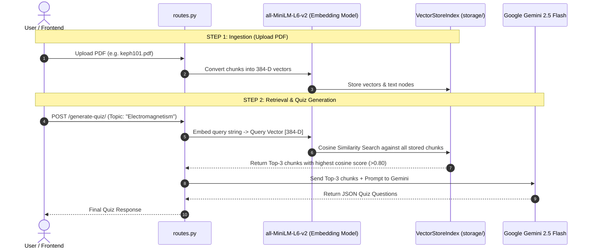

# 📐 Deep Dive Research Note: Text Embeddings & Cosine Similarity

---

## 📌 1. Executive Overview

Modern AI aur Natural Language Processing (NLP) me computers words ya text ko direct nahi samajh sakte. Computers sirf numbers aur matrices samajhte hain.

* **Embedding:** Text (words, sentences, paragraphs, documents) ko continuous, dense numerical vectors (arrays of floating numbers) me convert karne ki technique hai, jisme text ka **semantic meaning (arth/bhavna)** preserve rehta hai.
* **Cosine Similarity:** Do vectors ke beech ka angle $\theta$ calculate karke yeh measure karne ka mathematical formula hai ki dono texts ka meaning ek-doosre ke kitna kareeb (similar) hai.

Yeh dono concepts modern **RAG (Retrieval-Augmented Generation)**, **Semantic Search**, aur **Vector Databases** ki foundation hain.

---

## 🧠 2. What is an Embedding? (Intuition & Mechanics)

### A. The Core Intuition: The "Conceptual Map"
Agar hum duniya ke saare concepts ko ek multi-dimensional space me map karein:
* *"Cat"* aur *"Kitten"* space me ek dusre ke bilkul paas honge.
* *"Dog"* unke kareeb hoga (kyunki dono domestic pets hain).
* *"Aeroplane"* ya *"Quantum Physics"* unse bohot door honge.



### B. One-Hot Encoding vs Dense Embeddings
Pehle purane NLP me **One-Hot Encoding** ya **Bag-of-Words** use hota tha:
* Har word ke liye ek huge sparse vector (thousands of zeros, single one):
  * *"Cat"* = `[1, 0, 0, 0, 0, ...]`
  * *"Kitten"* = `[0, 1, 0, 0, 0, ...]`
* **Problem:** Isme do words ke beech ka mathematical correlation **0** hota tha! System ko nahi pata chalta tha ki *Cat* aur *Kitten* similar hain.

**Modern Dense Embeddings:**
* Fixed size continuous float values (e.g., 384 dimensions in `all-MiniLM-L6-v2`):
  * *"Cat"* = `[0.123, -0.456, 0.789, ..., 0.041]` (384 numbers)
  * *"Kitten"* = `[0.121, -0.450, 0.780, ..., 0.045]` (384 numbers)
* Do vectors ke numbers ek-doosre se match karte hain, jisse model semantic relationship capture karta hai.

### C. Embedding Model used in this Project
Aapke project (`app/core/engine.py`) me hum use kar rahe hain:
* **Model:** `sentence-transformers/all-MiniLM-L6-v2`
* **Output Dimensions:** **384 dimensions** (har text chunk 384 floating-point numbers ka vector banta hai).
* **Speed & Size:** Sirf ~80MB size, CPU par superfast inference, zero API quota issues.

---

## 📐 3. What is Cosine Similarity? (Mathematics & Geometry)

Jab do texts ke vectors ban jate hain (let's say Vector $\mathbf{A}$ aur Vector $\mathbf{B}$), hume yeh calculate karna hota hai ki dono kitne similar hain.

### A. Geometric Intuition
Cosine Similarity dono vectors ke beech ke **Angle ($\theta$)** ka cosine measure karta hai:



* Agar do vectors **same direction** point kar rahe hain ($\theta = 0^\circ$):
  $$\cos(0^\circ) = \mathbf{1.0} \quad \text{(Identical Meaning)}$$
* Agar do vectors **perpendicular / orthogonal** hain ($\theta = 90^\circ$):
  $$\cos(90^\circ) = \mathbf{0.0} \quad \text{(No Relationship)}$$
* Agar do vectors **opposite direction** point kar rahe hain ($\theta = 180^\circ$):
  $$\cos(180^\circ) = \mathbf{-1.0} \quad \text{(Opposite Meaning)}$$

---

### B. Mathematical Formula

Cosine similarity formula:

$$\text{Cosine Similarity}(\mathbf{A}, \mathbf{B}) = \cos(\theta) = \frac{\mathbf{A} \cdot \mathbf{B}}{\|\mathbf{A}\|_2 \|\mathbf{B}\|_2}$$

Expanded form across $n$ dimensions:

$$\cos(\theta) = \frac{\sum_{i=1}^n A_i B_i}{\sqrt{\sum_{i=1}^n A_i^2} \cdot \sqrt{\sum_{i=1}^n B_i^2}}$$

Jahan:
1. **$\mathbf{A} \cdot \mathbf{B}$ (Dot Product):** $\sum_{i=1}^n A_i \times B_i$ (Dono vectors ke corresponding dimensions ka multiplication aur sum).
2. **$\|\mathbf{A}\|_2$ (L2 Norm / Magnitude):** Vector ki physical length = $\sqrt{A_1^2 + A_2^2 + \dots + A_n^2}$.
3. **Denominator:** Dono vectors ke magnitudes se divide karke hum vector ki length ko normalize kar dete hain.

---

### C. Why Cosine Similarity over Euclidean Distance? (Crucial Concept!)

Yeh interview aur production design ka sabse important sawal hai: **"Text search me Euclidean Distance ke badle Cosine Similarity kyun use hoti hai?"**

| Scenario | Short Sentence ($A$) | Long Paragraph ($B$) |
| :--- | :--- | :--- |
| **Content** | *"Machine learning is great"* (4 words) | *"Machine learning is great... [repeated with details 100 words]"* |
| **Direction** | Same semantic topic (AI/ML) | Same semantic topic (AI/ML) |
| **Vector Magnitude** | Small length | Large length |
| **Euclidean Distance ($L2$)** | **Large Distance!** (Length difference ki wajah se galat lagega ki unrelated hain) |
| **Cosine Similarity** | **Near 1.0!** (Length ignore karke angle dekhta hai, accurately catches similarity) |

> [!IMPORTANT]
> **Key Takeaway:** Cosine similarity text ki **length / word count** se affect nahi hoti; yeh sirf **topic / direction of meaning** par focus karti hai.

---

### D. The Vector Normalization Optimization (Unit Vectors)

Production vector databases (jaise Faiss, Chroma, Qdrant) me ek standard trick use hoti hai:
Agar saare vectors ko pehle se **L2-Normalize** (Unit Vector bana diya jaye, $\|\mathbf{A}\| = 1$):

$$\|\mathbf{A}\| = 1, \quad \|\mathbf{B}\| = 1 \implies \text{Cosine Similarity}(\mathbf{A}, \mathbf{B}) = \mathbf{A} \cdot \mathbf{B} \quad \text{(Pure Dot Product!)}$$

Isse division aur square root ka heavy CPU calculation eliminate ho jata hai. Ek single **Matrix Dot Product (GEMM)** se lakho chunks ka similarity score kuch milliseconds me nikal jata hai!

---

## ⚖️ 4. Similarity Metrics Comparison

| Metric | Formula | Value Range | Best Used For |
| :--- | :--- | :--- | :--- |
| **Cosine Similarity** | $\frac{\mathbf{A} \cdot \mathbf{B}}{\|\mathbf{A}\| \|\mathbf{B}\|}$ | $[-1.0, +1.0]$ | Text & NLP, Document RAG, Semantic Caching |
| **Dot Product (Inner Product)** | $\mathbf{A} \cdot \mathbf{B}$ | $(-\infty, +\infty)$ | Normalized embeddings (Faiss / GPU search) |
| **Euclidean Distance ($L2$)** | $\sqrt{\sum (A_i - B_i)^2}$ | $[0, +\infty)$ | Image embeddings, Computer Vision, Clustering (K-Means) |
| **Manhattan Distance ($L1$)** | $\sum \|A_i - B_i\|$ | $[0, +\infty)$ | High dimensional sparse data, grid routing |

---

## 🔄 5. How Embeddings & Cosine Similarity Power RAG (`quiz-rag-backend`)

Aapke quiz generator backend me yeh kaise operate karta hai:



### Practical Score Thresholds in RAG:
* **0.88 - 1.00:** Strong Match (Direct answer context present).
* **0.75 - 0.87:** Good Semantic Relevance (Helpful background context).
* **0.60 - 0.74:** Weak / Broad Correlation (May produce hallucinations).
* **< 0.60:** Irrelevant Noise (Discard chunk).

---

## 💻 6. Hands-On Python Implementations

### A. Pure Python + NumPy (From Scratch)

```python
import numpy as np

def cosine_similarity(vec_a: np.ndarray, vec_b: np.ndarray) -> float:
    """Calculate cosine similarity between two 1D numpy vectors."""
    dot_product = np.dot(vec_a, vec_b)
    norm_a = np.linalg.norm(vec_a)
    norm_b = np.linalg.norm(vec_b)

    if norm_a == 0.0 or norm_b == 0.0:
        return 0.0

    return float(dot_product / (norm_a * norm_b))

# Example:
v1 = np.array([0.5, 0.8, 0.1])
v2 = np.array([0.48, 0.79, 0.12])   # Very close to v1
v3 = np.array([-0.9, 0.1, -0.4])    # Completely different

print(f"Similarity (v1, v2): {cosine_similarity(v1, v2):.4f}")  # ~0.999
print(f"Similarity (v1, v3): {cosine_similarity(v1, v3):.4f}")  # ~-0.42
```

---

### B. Using SentenceTransformers (Same model as your project)

```python
from sentence_transformers import SentenceTransformer, util

# 1. Load your project's embedding model
model = SentenceTransformer("sentence-transformers/all-MiniLM-L6-v2")

# 2. Sentences to compare
sentences = [
    "What is Object Oriented Programming in Python?",
    "Explain OOP concepts like classes and inheritance in Python.",
    "How to bake a chocolate cake at home?"
]

# 3. Compute Embeddings (Shape: 3 x 384)
embeddings = model.encode(sentences, convert_to_tensor=True)

# 4. Compute Cosine Similarity Matrix
cosine_scores = util.cos_sim(embeddings, embeddings)

print(f"Sentence 0 vs Sentence 1: {cosine_scores[0][1]:.4f}") # High (~0.88+)
print(f"Sentence 0 vs Sentence 2: {cosine_scores[0][2]:.4f}") # Low  (~0.08)
```

---

## ⚡ 7. Production Scaling: How Databases Search Millions of Vectors

Agar database me 1,000,000 PDF pages hain, toh har incoming query ke sath 1,000,000 cosine similarities calculate karna ($O(N)$ linear scan) slow ho jayega.

Production Vector Databases **Approximate Nearest Neighbors (ANN)** algorithms use karte hain:

1. **HNSW (Hierarchical Navigable Small World):**
   * Vectors ko multi-layer graph structures me organize karta hai.
   * Search time $O(N)$ se gir kar **$O(\log N)$** (~5ms for millions of vectors) ho jata hai.
2. **IVF (Inverted File Index):**
   * Vector space ko Voronoi cells me cluster karta hai aur query ke nearest cluster me hi cosine search karta hai.
3. **Product Quantization (PQ):**
   * 32-bit floats ko 8-bit integers me compress karke RAM usage ko 75% bacha deta hai.

---

## 🎯 Summary Checklist

| Concept | What It Is | Why It Matters in Quiz RAG |
| :--- | :--- | :--- |
| **Embedding** | 384-D numerical array representing semantic meaning. | PDF text ko machine-searchable format me convert karta hai. |
| **Cosine Similarity** | Angle $\theta$ between vectors $[-1 \text{ to } +1]$. | User ke topic ke sabse relevant document chunks find karta hai. |
| **Scale Invariance** | Length of text doesn't affect angle. | Chhote sawal aur lambe paragraph chunk ko sahi se match karta hai. |
| **Dot Product Trick** | Pre-normalized vectors $\implies$ pure dot product. | Blazing fast search speed across thousands of chunks. |
