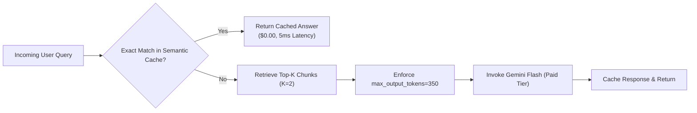

# 🪙 Google Gemini Token Economics & Pricing Architecture
### Comprehensive Guide to Token Calculation, Unit Economics, and Billing Auditing

---

## 1. Introduction: Fundamentals of LLM Tokens

Large Language Models (LLMs) such as Google Gemini do not process text as individual characters or whole words. Instead, text is decomposed into discrete computational chunks known as **Tokens** via sub-word tokenization algorithms (Byte-Pair Encoding).

### 1.1. Core Rules of Tokenization

* **English Text:** 
  * $1\text{ Token} \approx 0.75\text{ Words}$ (or approximately $4\text{ alphanumeric characters}$).
  * $100\text{ English Words} \approx 130\text{ to }140\text{ Tokens}$.
* **Multilingual & Indic Text (Hindi / Hinglish / Regional):**
  * Sub-word fragmentation is slightly higher due to Unicode character composition.
  * $1\text{ Word} \approx 1.5\text{ to }2.0\text{ Tokens}$.
* **Punctuation & Whitespace:**
  * Punctuation marks, indentations, and JSON syntax elements (`{`, `}`, `[`, `]`, `"`) each consume between $1\text{ and }2\text{ tokens}$.

### 1.2. Practical Scale Reference Table

| Text Unit | Typical Word Count | Estimated Token Consumption |
| :--- | :--- | :--- |
| **Short Support Query** | 10 – 15 words | **~20 – 35 tokens** |
| **Standard Support Paragraph** | 100 words | **~130 – 150 tokens** |
| **System Prompt & Guardrails** | 250 – 400 words | **~350 – 500 tokens** |
| **Retrieved RAG Context (Top 2-3 Chunks)** | 800 – 1,000 words | **~1,100 – 1,400 tokens** |
| **Single A4 Documentation Page** | 500 words | **~650 – 750 tokens** |
| **10-Page ERP User Manual** | 5,000 words | **~6,500 – 7,500 tokens** |
| **Complete 100-Page Technical Specification** | 50,000 words | **~65,000 – 75,000 tokens** |

---

## 2. Google AI Billing Mechanics: Input vs. Output Tokens

Google AI Studio and Vertex AI structure their pricing on a **Per 1 Million Tokens ($1\text{ MTok} = 10^6\text{ tokens}$)** basis.

```
┌────────────────────────────────────────────────────────────────────────┐
│                        BILLABLE REQUEST ANATOMY                        │
├───────────────────────────────────┬────────────────────────────────────┤
│           INPUT TOKENS            │           OUTPUT TOKENS            │
├───────────────────────────────────┼────────────────────────────────────┤
│ • System Instructions & Persona   │ • Model Response Content           │
│ • Retrieved RAG Manual Excerpts   │ • Generated Steps / Solutions      │
│ • Chat History (Previous Turns)   │ • Structured JSON Payload          │
│ • Current User Inquiry            │ • "Thinking" / Reasoning Tokens    │
│                                   │                                    │
│ Price Rate: Low ($0.075 / 1M)     │ Price Rate: Premium ($0.300 / 1M)  │
└───────────────────────────────────┴────────────────────────────────────┘
```

### Why Output Tokens Cost 3x to 4x More:
* **Input processing** is executed in parallel across GPU/TPU matrix accelerators via forward self-attention passes.
* **Output generation** is strictly auto-regressive and sequential: the model must generate token $N$ before computing token $N+1$, maintaining continuous GPU memory state and compute overhead.

---

## 3. Official Google Gemini Model Pricing Matrix

*(Current rates verified from official Google AI developer documentation. Conversion baseline: $1\text{ USD} \approx ₹86.00\text{ INR}$ with an additional $18\%\text{ statutory GST buffer} \approx ₹100\text{ effective/USD}$).*

| Model Architecture | Recommended Workload | Input Rate (per 1M Tokens) | Output Rate (per 1M Tokens) | Cost per Typical Request |
| :--- | :--- | :--- | :--- | :--- |
| **Gemini 1.5 / 2.0 / 2.5 Flash** *(Recommended)* | High-concurrency support bots, RAG pipelines, quiz generators | **$0.075** (~₹6.45) | **$0.300** (~₹25.80) | **~$0.00025 (₹0.022 / 2.2 paise)** |
| **Gemini Flash-Lite** | Ultra low-latency classifications, intent routing, summarization | **$0.075 – $0.100** (~₹6.45 – ₹8.60) | **$0.300 – $0.400** (~₹25.80 – ₹34.40) | **~$0.00020 (₹0.017 / 1.7 paise)** |
| **Gemini 1.5 / 3.1 Pro** | Complex multi-step reasoning, mathematical problem solving, deep code analysis | **$1.25 – $2.00** (~₹107.50 – ₹172.00) | **$5.00 – $10.00** (~₹430.00 – ₹860.00) | **~$0.0040 (₹0.35 / 35 paise)** |
| **Text-Embedding-004** | Cloud-based semantic embeddings (if not using local in-process models) | **$0.020** (~₹1.72) | N/A (Input only) | **Negligible** |

---

## 4. Mathematical Cost Formulation & Unit Economics

### 4.1. Universal Query Cost Formula

The aggregate cost for any generative inference cycle is computed as:

$$C_{\text{query}} = \left( \frac{T_{\text{in}}}{10^6} \times P_{\text{in}} \right) + \left( \frac{T_{\text{out}}}{10^6} \times P_{\text{out}} \right)$$

Where:
* $T_{\text{in}}$ = Count of input tokens (Prompt + RAG Context + History + User Message)
* $P_{\text{in}}$ = Model input price per $1,000,000$ tokens ($\$0.075$ for Gemini Flash)
* $T_{\text{out}}$ = Count of generated output tokens
* $P_{\text{out}}$ = Model output price per $1,000,000$ tokens ($\$0.300$ for Gemini Flash)

---

### 4.2. Workload Scenario A: School ERP Administrative Support Query

**Scenario:** A school accountant inquires: *"How do I generate and print a duplicate quarterly fee receipt with custom concessions?"*

1. **Input Token Audit ($T_{\text{in}}$):**
   * System Prompt (Behavioral guardrails, output schema): $450\text{ tokens}$
   * Retrieved Knowledge Base (Top 2 chunks from ERP manual): $1,250\text{ tokens}$
   * Dialogue History (Previous turn context): $200\text{ tokens}$
   * User Inquiry: $60\text{ tokens}$
   * **Total Input ($T_{\text{in}}$):** **$1,960\text{ tokens}$**

$$\text{Input Cost} = \frac{1,960}{1,000,000} \times \$0.075 = \$0.000147$$

2. **Output Token Audit ($T_{\text{out}}$):**
   * 4-step actionable navigation guide: **$280\text{ tokens}$**

$$\text{Output Cost} = \frac{280}{1,000,000} \times \$0.300 = \$0.000084$$

3. **Total Query Financial Cost:**
   $$C_{\text{query}} = \$0.000147 + \$0.000084 = \mathbf{\$0.000231}\text{ USD}$$
   $$\text{In Indian Rupees (at ₹86/USD)} = \$0.000231 \times 86 = \mathbf{₹0.0198}\text{ (~2.0 paise)}$$

---

### 4.3. Workload Scenario B: Automated Quiz Generation Request

**Scenario:** Generating 5 multiple-choice questions (MCQs) in JSON format from an uploaded educational textbook chapter.

1. **Input:** System prompt ($250\text{ tokens}$) + Context ($1,500\text{ tokens}$) = **$1,750\text{ tokens}$** $\rightarrow \mathbf{\$0.000131}$
2. **Output:** 5 MCQs with options, explanations, and answer keys = **$550\text{ tokens}$** $\rightarrow \mathbf{\$0.000165}$
3. **Total Request Cost:** $\mathbf{\$0.000296}\text{ USD}$ $\approx \mathbf{₹0.0255}\text{ INR}$ (~2.5 paise).
4. **Cost per Individual MCQ:** $\frac{₹0.0255}{5} = \mathbf{₹0.0051}\text{ (~0.5 paise per question)}$.

---

### 4.4. Scaling Matrix & Purchasing Power Parity

| Budget (INR) | Budget (USD) | Support Queries Handled | Individual MCQs Generated |
| :--- | :--- | :--- | :--- |
| **₹1.00** | ~$0.012 | **45 – 50 queries** | **~200 questions** |
| **₹10.00** | ~$0.116 | **450 – 500 queries** | **~2,000 questions** |
| **₹100.00** | ~$1.16 | **4,500 – 5,000 queries** | **~20,000 questions** |
| **₹500.00** | ~$5.81 | **22,500 – 25,000 queries** | **~100,000 questions** |
| **₹1,000.00** | ~$11.62 | **45,000 – 50,000 queries** | **~200,000 questions** |

---

## 5. How to Determine and Audit Model Charges

There are three primary methods to verify model charges and track token usage with mathematical certainty.

### Method 1: Official Documentation & Pricing Portal
* **Direct Source of Truth:** [https://ai.google.dev/pricing](https://ai.google.dev/pricing)
* Regularly consult this portal to inspect:
  * Baseline input/output rates per model generation.
  * Context caching discounts (up to $75\%$ cheaper for cached prompts exceeding $32\text{k tokens}$).
  * Tier specifications (Free Tier limits vs. Paid Tier scalability).

---

### Method 2: Google AI Studio Web Playground Live Counter
Before integrating text or documentation into backend code, test payloads interactively:
1. Navigate to [aistudio.google.com](https://aistudio.google.com).
2. Paste the intended system prompt, RAG manual context, and sample query into the editor.
3. Observe the dynamic token gauge in the bottom-right corner:
   $$\text{Tokens: 1,842 / 1,048,576}$$
4. This provides exact token usage without writing any instrumentation code.

---

### Method 3: Programmatic Tracking via Google GenAI Python SDK

The Google GenAI SDK allows developers to:
1. **Pre-flight token estimation:** Count tokens *before* invoking inference ($0 cost).
2. **Post-execution auditing:** Extract exact consumed tokens directly from `usage_metadata` in every response.

#### Production Python Telemetry Utility:

```python
import os
from google import genai

# Initialize client
client = genai.Client(api_key=os.environ.get("GEMINI_API_KEY"))

MODEL_ID = "gemini-2.5-flash"
SAMPLE_PROMPT = (
    "Provide step-by-step instructions to configure automated SMS fee alerts "
    "for late fee collections in School ERP v2.4."
)

# ---------------------------------------------------------------------------
# 1. Pre-flight Token Estimation (Zero API Cost)
# ---------------------------------------------------------------------------
token_count_response = client.models.count_tokens(
    model=MODEL_ID,
    contents=SAMPLE_PROMPT,
)
estimated_input_tokens = token_count_response.total_tokens
print(f"Pre-flight Estimated Tokens: {estimated_input_tokens}")

# ---------------------------------------------------------------------------
# 2. Execute Inference Request
# ---------------------------------------------------------------------------
response = client.models.generate_content(
    model=MODEL_ID,
    contents=SAMPLE_PROMPT,
)

# ---------------------------------------------------------------------------
# 3. Post-execution Metadata Extraction & Financial Audit
# ---------------------------------------------------------------------------
metadata = response.usage_metadata
actual_input_tokens = metadata.prompt_token_count
actual_output_tokens = metadata.candidates_token_count
total_consumed_tokens = metadata.total_token_count

# Financial Unit Rates (Gemini 2.5 Flash)
EXCHANGE_RATE_USD_INR = 86.00
RATE_INPUT_PER_M_USD = 0.075
RATE_OUTPUT_PER_M_USD = 0.300

cost_input_usd = (actual_input_tokens / 1_000_000) * RATE_INPUT_PER_M_USD
cost_output_usd = (actual_output_tokens / 1_000_000) * RATE_OUTPUT_PER_M_USD
total_cost_usd = cost_input_usd + cost_output_usd
total_cost_inr = total_cost_usd * EXCHANGE_RATE_USD_INR

print("\n========== INFERENCE FINANCIAL AUDIT ==========")
print(f"Model Invoked       : {MODEL_ID}")
print(f"Input Tokens        : {actual_input_tokens} (${cost_input_usd:.7f} USD)")
print(f"Output Tokens       : {actual_output_tokens} (${cost_output_usd:.7f} USD)")
print(f"Total Tokens        : {total_consumed_tokens}")
print(f"Total Query Cost USD: ${total_cost_usd:.6f}")
print(f"Total Query Cost INR: ₹{total_cost_inr:.4f} ({total_cost_inr * 100:.2f} paise)")
print("===============================================")
```

---

## 6. Architectural Cost Optimization Strategies

To ensure token expenditures remain permanently low during high-volume production:



1. **Local Vector Embeddings (`$0.00` Cost):**
   * Never bill third-party APIs for vector generation.
   * Host `sentence-transformers/all-MiniLM-L6-v2` locally in-process on CPU to achieve **$0.00 embedding expense** with zero network latency.
2. **Top-$K$ Context Pruning:**
   * Restrict vector search retrieval to `similarity_top_k=2` or `3`. Do not inject 10+ chunks into prompt context when 2 well-indexed documentation paragraphs suffice.
3. **Hard Output Token Boundaries:**
   * Explicitly configure `max_output_tokens=350` in model configuration parameters to prevent verbose, run-away text generations.
4. **Context Caching for Static Repositories:**
   * When user manuals exceed $32,768\text{ tokens}$ and remain identical across thousands of requests, enable Google's Context Caching. Cached prompt tokens receive an immediate **$75\%$ discount** ($$0.01875 / 1\text{M tokens}$).
5. **In-Memory Semantic Caching:**
   * Common questions like *"How to reset user password?"* or *"What is the standard receipt format?"* can be cached in Redis. Repetitive queries are served with **zero LLM token consumption**.

---

## 7. Financial Safeguards & Quota Governance

To eliminate the possibility of rogue scripts or anomalous traffic generating unexpected cloud invoices:

1. **Google Cloud Billing Hard Caps:**
   * In [Google Cloud Console (Billing)](https://console.cloud.google.com/billing), navigate to **Budgets & Alerts**.
   * Define an explicit monthly budget threshold (e.g., **₹1,000 / $12 USD**).
   * Configure alerting triggers at $50\%$, $80\%$, and $100\%$ budget consumption with automated email and SMS notification webhooks.
2. **Backend Rate-Limiting Middleware:**
   * Enforce client IP and session-level throttling via FastAPI middleware (`slowapi` or Redis token-bucket limiter):
     * Maximum $10\text{ requests / minute per client session}$.
     * Maximum $100\text{ requests / day per user account}$.
3. **Strict Separation of Development & Production Keys:**
   * Enforce separate API keys for local debugging and production deployments with designated project billing quotas.

---

## 8. Summary Comparison: Free Tier vs. Paid Tier

| Feature / Dimension | Google AI Studio Free Tier | Google AI Studio Paid Tier (Pay-As-You-Go) |
| :--- | :--- | :--- |
| **Direct Financial Cost** | **$0.00** | **~$0.00025 per query** (Pay-as-you-go) |
| **Data Privacy & Training** | ⚠️ Queries **logged and used** for model training | 🔒 **Zero training**. Enterprise data privacy guaranteed |
| **Rate Limit (RPM)** | Strict **15 RPM** (Unsuitable for peak hours) | **1,000+ RPM** (Scales dynamically) |
| **Daily Request Limit (RPD)** | **1,500 RPD** cap | **Virtually unlimited** |
| **Production Feasibility** | Prototyping & Dev only | **Mandatory for production SaaS / Multi-tenant ERP** |

---

## 9. Related Workspace Documentation

* For the Multi-School ERP deployment roadmap, see: [SCHOOL_ERP_SUPPORT_ESTIMATION.md](file:///d:/Personal/AI-QUIZ/quiz-rag-backend/doc/SCHOOL_ERP_SUPPORT_ESTIMATION.md)
* For Quiz Generator unit economics, see: [COST_ESTIMATION.md](file:///d:/Personal/AI-QUIZ/quiz-rag-backend/doc/COST_ESTIMATION.md)
* For the local embedding architecture, see: [EMBEDDINGS_AND_COSINE_SIMILARITY.md](file:///d:/Personal/AI-QUIZ/quiz-rag-backend/doc/EMBEDDINGS_AND_COSINE_SIMILARITY.md)
