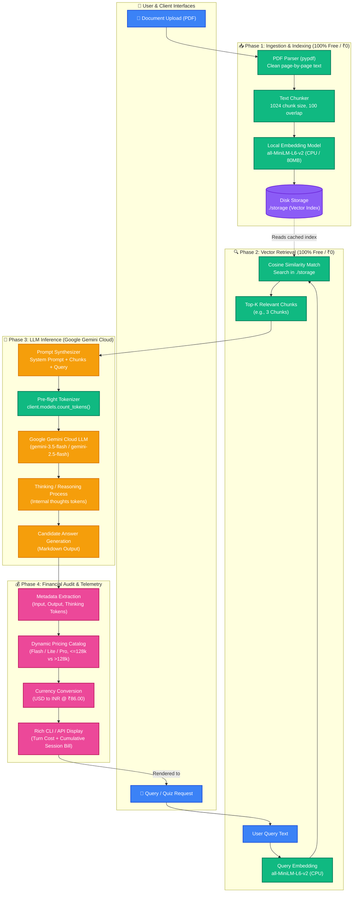
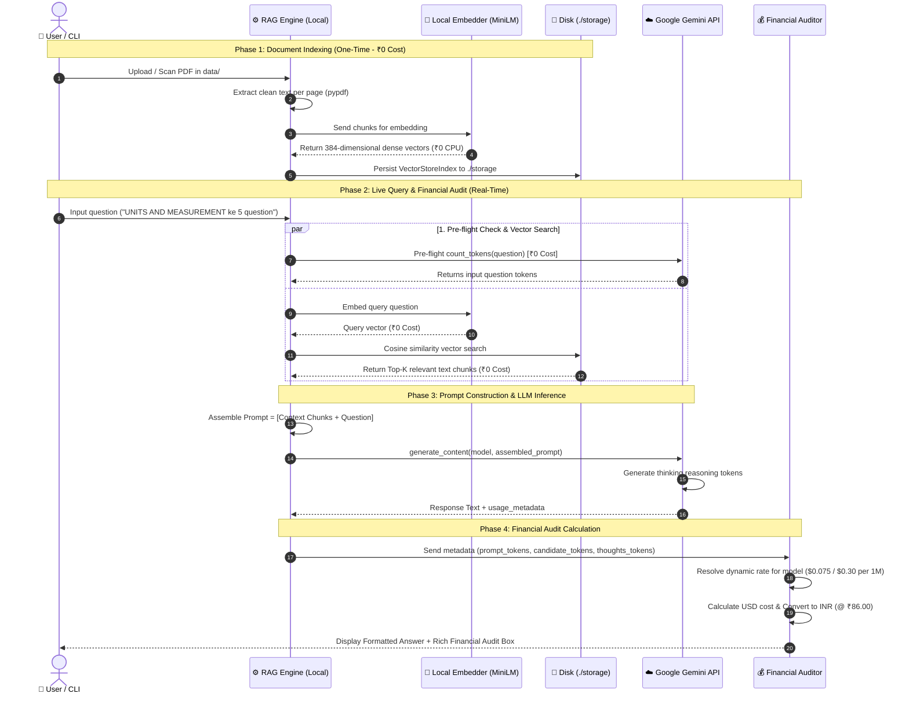
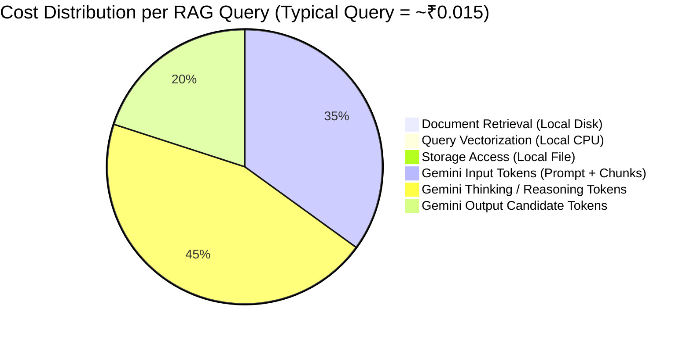

# 🔄 Complete RAG & Financial Audit Information Flow

Yeh document hamare **RAG Quiz & Chat Backend** ke information flow, data movement, aur financial telemetry ka complete visual diagram provide karta hai.

---

## 1. High-Level Architectural Flow

---

## 2. Sequence Diagram: Step-by-Step Data Movement

Yeh sequence diagram har request ke exact lifecycle ko chronologically dikhata hai:

---

## 3. Cost Attribution Matrix (Kis Step me Kitna Kharcha?)

---

## 4. Key Architectural Insights

1. **Zero-Cost Storage & Retrieval**:
   - Vector database local disk (`./storage`) me in-process chalta hai.
   - Retrieval ke liye kisi cloud provider (jaise Pinecone ya Weaviate) ko subscription nahi dena padta.
2. **Local CPU Embeddings (`all-MiniLM-L6-v2`)**:
   - 80MB ka compact model server ke CPU/RAM par chalta hai.
   - 0 API latency, 0 rate limits, aur 0 cost.
3. **Pay-As-You-Go LLM Generation**:
   - Bill sirf aur sirf **Google Gemini LLM** API calls ka banta hai.
   - Flash model ke sath typical query ka kharcha sirf **1 se 2 paise (₹0.01 – ₹0.02)** hota hai.
