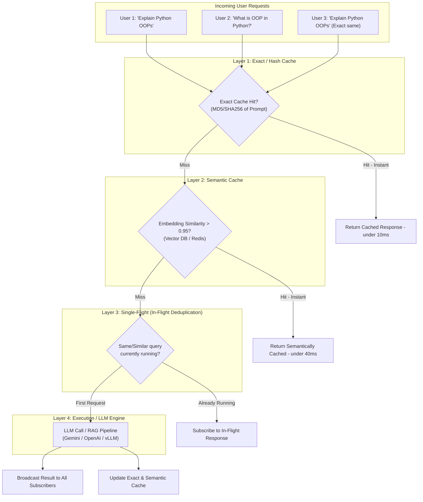
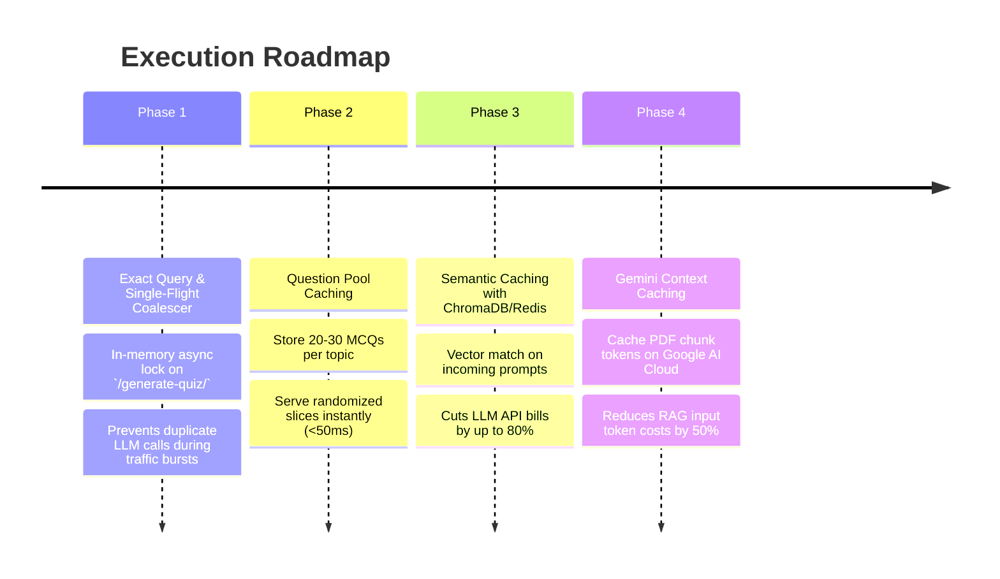

# 🔬 Research Document: Query Batching, Request Coalescing & Semantic Caching in AI Pipelines

---

## 📌 Executive Summary

Modern high-scale AI systems (jaise ChatGPT, Perplexity, aur Google Search AI) har incoming request ke liye isolated, independent LLM call nahi karte. Agar lakho users simultaneously queries bhej rahe hain, toh raw 1:1 LLM calls se:
1. **API Costs explode** ho jayenge (redundant token processing).
2. **Rate Limits (RPM/TPM)** hit ho jayenge.
3. **GPU Compute waste** hoga (similar prefix/attention repeatedly calculate hota hai).

Isko solve karne ke liye production pipelines me **Query Deduplication**, **In-Flight Request Coalescing (Single-Flight)**, **Semantic Caching**, aur **Continuous Batching** ka use kiya jata hai.

Yeh document explain karta hai ki yeh architecture kaise kaam karta hai, iske design patterns kya hain, aur ise **FastAPI + RAG backend** me kaise implement kiya ja sakta hai.

---

## 🏗️ 1. Core Architectural Patterns

Jab hum kehte hain *"similar query ko merge karke process karna"*, toh industry me iske **4 primary layers** hote hain:



---

### Pattern 1: Semantic Caching (Pre-Execution Deduplication)

* **Concept:** User ki query ko execute karne se pehle uska embedding generate kiya jata hai aur vector store me search kiya jata hai.
* **Mechanism:**
  * User A: *"Write 5 MCQs on Photosynthesis"*
  * User B: *"Generate a quiz of 5 questions about photosynthesis"*
  * Dono queries ke embeddings ka **Cosine Similarity ~ 0.96** hota hai.
  * System pehli query ka generated answer cache kar leta hai. User B ko bina LLM call kiye wahi high-quality response mil jata hai.
* **Latency:** ~30ms – 60ms (LLM ke 2s - 4s ke mukable 98% faster).
* **Tools in Market:** `GPTCache`, `Redis Vector Search`, `Qdrant`, `ChromaDB`.

---

### Pattern 2: Request Coalescing / Single-Flight (In-Flight Deduplication)

* **Concept:** Agar multiple users ek hi waqt (lagbhag same microsecond/second) par identical ya similar query bhejte hain, toh system duplicate LLM calls initiate nahi karta.
* **Mechanism:**
  * Ek lock/in-progress registry maintain hoti hai: `active_requests = {}`.
  * User 1 query bhejta hai -> Backend creates an `asyncio.Future()` / task in registry and starts LLM call.
  * User 2 same query bhejta hai -> Registry dekhti hai ki yeh task already active hai. User 2 naya call nahi karta, balki usi Future pe `await` karta hai.
  * LLM response aate hi dono users ko ek saath result bhej diya jata hai (Fan-out).
* **Best For:** Breaking news, trending exam topics, viral live quizzes.

---

### Pattern 3: Dynamic Micro-Batching (Window-Based Processing)

* **Concept:** Requests ko ek short time window (e.g., 50ms - 200ms) ke liye buffer karna aur batch me LLM ko bhejna.
* **Mechanism:**
  * Standalone queries ko group karke single batch payload banaya jata hai.
  * Self-hosted LLMs me yeh **Continuous Batching / PagedAttention** (vLLM engine) ke through GPU throughput ko 10x-20x boost deta hai.
* **Consideration for API (Gemini/OpenAI):**
  * Third-party APIs me agar single prompt me 5 questions merge kiye:
    *"Q1: ..., Q2: ..., Q3: ..."*
    Toh parsing aur individual response splitting complex ho jati hai, aur user response time badh sakta hai.

---

### Pattern 4: Shared Prefix Caching (Prompt Cache)

* **Concept:** ChatGPT me jab lakho users same system prompt ya same reference documents share karte hain, toh LLM provider KV-Cache (Key-Value Cache) share karta hai.
* **How it helps RAG:** Agar 100 users ne same PDF document (`keph101.pdf`) par quiz banwaya, toh LLM document tokens ko bar-bar re-read nahi karta. Provider level par **Gemini Context Caching** ya **OpenAI Prompt Caching** automatically 50% cost aur latency cut kar deta hai.

---

## 📊 2. Comparative Analysis of Approaches

| Feature / Metric | Standard 1:1 Execution | Semantic Caching | Single-Flight (In-Flight) | Micro-Batching (Prompt Merging) |
| :--- | :--- | :--- | :--- | :--- |
| **API Cost Reduction** | 0% (Full cost) | **80% - 95%** (on repeated topics) | **50% - 70%** (during peak spikes) | 20% - 40% |
| **Response Latency** | 2000ms - 5000ms | **< 50ms** | Same for 1st user, 0 delay for 2nd | +50-200ms window delay |
| **Implementation Effort**| None (Baseline) | Low-Medium | Low (Pure Python `asyncio`) | High (Parsing & Splitting) |
| **Risk of Wrong Context**| 0% | Low (tunable threshold) | 0% (Exact match) | Medium (Prompt bleeding) |
| **Streaming Compatibility**| Simple | Simple | Moderate (Broadcaster required)| Complex |

---

## 🛠️ 3. Concrete Implementation Blueprint (FastAPI + Python)

### Component A: In-Flight Request Coalescer (Single-Flight Pattern)

Yeh pure Python `asyncio` implementation hai bina kisi external dependency ke:

```python
import asyncio
from typing import Dict, Any, Callable, Coroutine

class RequestCoalescer:
    def __init__(self):
        # Stores query_key -> asyncio.Future
        self._in_flight: Dict[str, asyncio.Future] = {}
        self._lock = asyncio.Lock()

    async def execute(self, key: str, task_fn: Callable[[], Coroutine[Any, Any, Any]]) -> Any:
        async with self._lock:
            # Case 1: Agar request already processing me hai
            if key in self._in_flight:
                future = self._in_flight[key]
                # Lock release karke usi existing task ka wait karo
                return await asyncio.shield(future)

            # Case 2: Yeh first request hai
            loop = asyncio.get_running_loop()
            future = loop.create_future()
            self._in_flight[key] = future

        # Actual heavy execution (LLM / RAG call)
        try:
            result = await task_fn()
            future.set_result(result)
            return result
        except Exception as exc:
            future.set_exception(exc)
            raise exc
        finally:
            # Clean up after completion
            async with self._lock:
                self._in_flight.pop(key, None)
```

---

### Component B: Semantic Cache Engine

ChromaDB ya In-Memory Vector Store se semantic match:

```python
import numpy as np
from typing import Optional, Dict, Any

class SemanticQuizCache:
    def __init__(self, similarity_threshold: float = 0.93):
        self.threshold = similarity_threshold
        # In production: Redis Vector Store or ChromaDB collection
        self.cache_entries = []  # [{ "embedding": [...], "query": "...", "response": {...} }]

    def _cosine_similarity(self, a, b):
        return np.dot(a, b) / (np.linalg.norm(a) * np.linalg.norm(b))

    async def lookup(self, query_vector: list[float]) -> Optional[Dict[str, Any]]:
        best_match = None
        highest_score = -1.0

        for entry in self.cache_entries:
            score = self._cosine_similarity(query_vector, entry["embedding"])
            if score > highest_score:
                highest_score = score
                best_match = entry

        if highest_score >= self.threshold and best_match:
            return best_match["response"]
        return None

    async def store(self, query_vector: list[float], query_text: str, response: Dict[str, Any]):
        self.cache_entries.append({
            "embedding": query_vector,
            "query": query_text,
            "response": response
        })
```

---

### Component C: Integrating into FastAPI Endpoint (`routes.py`)

```python
coalescer = RequestCoalescer()
semantic_cache = SemanticQuizCache(similarity_threshold=0.94)

@router.post("/generate-quiz-optimized/")
async def generate_quiz_optimized(request: QuizGenerateRequest):
    # 1. Normalise topic key
    cache_key = f"{request.topic.strip().lower()}_{request.num_questions}_{request.difficulty}"

    # 2. Check Semantic Cache
    query_emb = get_embedding(cache_key)
    cached_response = await semantic_cache.lookup(query_emb)
    if cached_response:
        return {"source": "semantic_cache", "data": cached_response}

    # 3. Use Coalescer for In-Flight deduplication
    async def run_pipeline():
        response = await query_engine.agenerate_quiz(request)
        await semantic_cache.store(query_emb, cache_key, response)
        return response

    result = await coalescer.execute(cache_key, run_pipeline)
    return {"source": "llm_fresh", "data": result}
```

---

## ⚠️ 4. Potential Pitfalls & How to Handle Them

1. **Non-Determinism & Randomness (Temperature > 0):**
   * *Problem:* Agar har user ko different unique quiz questions chahiye, toh direct cached response unhe duplicate lag sakta hai.
   * *Solution:* Cache me 20-30 questions ka **question pool** store karein. Jab koi user 5 questions maange, toh cached pool me se random 5 sample karke instantly return kar dein!
2. **Context Bleeding (Personalized Sessions):**
   * Agar user ka chat history ya user identity response ko alter karti hai, toh queries merge nahi karni chahiye. Yeh pipeline **strictly context-free queries** (RAG search, topic quiz, general FAQs) ke liye honi chahiye.
3. **Cache Invalidation on Document Re-upload:**
   * Agar kisi user ne PDF document update/re-upload kar diya, toh us document se jude saare semantic cache keys ko invalidate ya document hash ke sath namespace karna zaroori hai:
     `key = hash(document_content) + "_" + hash(query)`
4. **False Positive Semantic Matches:**
   * Cosine threshold ko bahut low mat rakhein (e.g. < 0.90). Example: *"Python 2 vs Python 3"* aur *"Python vs C++"* ka similarity score moderate ho sakta hai, lekin unke quiz questions totally different hone chahiye. Recommended threshold: **0.93 - 0.96**.

---

## 🚀 5. Recommended Implementation Roadmap for `quiz-rag-backend`



---

## 🎯 Conclusion

Aapka idea **production-grade and high ROI (Return on Investment)** hai. Sabse best approach yeh hogi:
1. **Single-Flight Coalescer** implement karna (Yeh bohot simple hai aur immediate protection deta hai).
2. **Question-Pool Semantic Cache** banana jisse latency instant ho jaye aur API cost 80%+ drop ho jaye.
