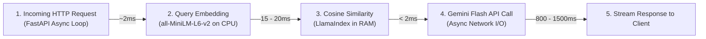

# 🚀 RAG, Server Infrastructure & Concurrency Scaling Analysis
### End-to-End Cost Blueprint and High-Throughput Capacity Benchmarks

---

## 1. Executive Summary

This engineering blueprint establishes the operational costs, infrastructure sizing, and concurrency capacity for deploying a **Retrieval-Augmented Generation (RAG)** support system powered by **FastAPI**, **LlamaIndex / local vector stores**, **local CPU embeddings (`all-MiniLM-L6-v2`)**, and the **Google Gemini 2.5/2.0 Flash API**.

### Key Architectural Takeaways:
* **RAG Vector Storage Expense:** **$0.00 / ₹0.00** (100% free; self-hosted in-process vector retrieval).
* **Server Hosting Expense:** **$5.00 – $15.00 / month (₹450 – ₹1,200 / month)** for a 2–4 vCPU cloud VPS.
* **LLM Inference Expense:** **~$0.00025 / query (~₹0.022 / 2.2 paise)** via Gemini Flash.
* **Concurrency Capacity (2 vCPU / 2GB RAM):** Supports **20 – 30 Queries/Sec**, translating to **400 – 600 active simultaneous chatting users**.
* **Concurrency Capacity (4 vCPU / 4GB RAM):** Supports **60 – 80 Queries/Sec**, translating to **1,200 – 1,800 active simultaneous chatting users**.

---

## 2. Three-Tier Cost Architecture

```
┌────────────────────────────────────────────────────────────────────────┐
│                        THREE-TIER COST PYRAMID                         │
├─────────────────────────┬──────────────────────────┬───────────────────┤
│    1. RAG SUBSYSTEM     │  2. COMPUTE & HOSTING    │  3. LLM GENERATION│
│ (Embeddings + Database) │  (FastAPI + Python RAM)  │ (Gemini 2.5 Flash)│
│                         │                          │                   │
│       $0.00 / Month     │    $5 - $15 / Month      │ ~$0.00025 / Query │
│   (Local CPU In-Process)│   (Cloud Virtual Server) │ (Pay-as-you-go)   │
└─────────────────────────┴──────────────────────────┴───────────────────┘
```

### Tier 1: RAG Subsystem (Embeddings & Vector Store) — $0.00 / Month
* **Embedding Model (`sentence-transformers/all-MiniLM-L6-v2`):**
  * Runs entirely within the local Python runtime on CPU.
  * No third-party embedding API billing (e.g., OpenAI `$0.02/1M` or Google Cloud embeddings avoided).
  * **Monthly Cost: $0.00 (Unlimited embeddings).**
* **Vector Database (LlamaIndex Disk Index / FAISS / Chroma):**
  * An entire 500-page ERP user manual produces approximately $1,500$ chunks ($384$-dimensional vectors).
  * The resulting vector index consumes **< 10 MB of disk space** and loads into memory in **< 50 milliseconds**.
  * No managed cloud vector database subscription (e.g., Pinecone $70/month) is required.
  * **Monthly Cost: $0.00.**

---

### Tier 2: Server & Compute Hosting — $5.00 to $15.00 / Month
The FastAPI microservice and embedding weights require a minimum of **1.5 GB to 2.0 GB of RAM** in memory:

| Deployment Profile | Compute Specifications | Recommended Provider | Monthly Cost (USD) | Monthly Cost (INR) | Capacity Threshold |
| :--- | :--- | :--- | :--- | :--- | :--- |
| **Existing Server Co-location** | Allocate 2GB RAM on existing ERP server | Existing Host | **$0.00** | **₹0.00** | Up to 50 Schools |
| **Standard Cloud VPS** *(Recommended)* | 2 vCPU, 2GB–4GB RAM, 40GB NVMe | Hetzner Cloud / DigitalOcean / AWS Lightsail | **$5.00 – $10.00** | **₹450 – ₹900** | Up to 250 Schools |
| **High-Throughput Production VPS** | 4 vCPU, 8GB RAM, 80GB NVMe | Hetzner / AWS EC2 (`t4g.xlarge`) | **$15.00 – $25.00** | **₹1,300 – ₹2,200** | Up to 1,000 Schools |

---

### Tier 3: LLM Generation (Google Gemini Flash) — Pay-As-You-Go
* Input Price: **$0.075 per 1,000,000 tokens** (~₹6.45 / 1M tokens)
* Output Price: **$0.300 per 1,000,000 tokens** (~₹25.80 / 1M tokens)
* Per-Query Breakdown:
  * Weighted Average Input Tokens: $2,000\text{ tokens}$ ($\$0.000150$)
  * Average Output Tokens: $250\text{ tokens}$ ($\$0.000075$)
  * **Total Cost per Support Query:** **$0.000225 USD (~₹0.020 / 2.0 paise)**

---

### 📊 Comprehensive Total Cost of Ownership (TCO) Projections

*(Assuming 4–5 support inquiries per school per business day = ~120 queries/school/month; 1 USD ≈ ₹86 INR)*

| Scale (Schools) | Monthly Queries | Gemini API Cost (USD) | Gemini API Cost (INR) | Server Hosting (INR) | Total Monthly Spend | Cost Per School / Month |
| :--- | :--- | :--- | :--- | :--- | :--- | :--- |
| **25 Schools** | 3,000 | $0.68 | ₹58 | ₹600 | **~₹658 / month** | **₹26.30 / school** |
| **50 Schools** | 6,000 | $1.35 | ₹116 | ₹600 | **~₹716 / month** | **₹14.30 / school** |
| **100 Schools** | 12,000 | $2.70 | ₹232 | ₹600 | **~₹832 / month** | **₹8.30 / school** |
| **250 Schools** | 30,000 | $6.75 | ₹580 | ₹850 | **~₹1,430 / month** | **₹5.70 / school** |
| **500 Schools** | 60,000 | $13.50 | ₹1,161 | ₹1,000 | **~₹2,161 / month** | **₹4.30 / school** |
| **1,000 Schools** | 120,000 | $27.00 | ₹2,322 | ₹1,500 | **~₹3,822 / month** | **₹3.80 / school** |

---

## 3. Concurrency & Throughput Analysis

### 3.1. Understanding Concurrency: RPS vs. Active Chatting Users

A common misconception in web engineering is confusing **Requests Per Second (RPS/QPS)** with **Concurrent Active Users**.

* **Queries Per Second (QPS):** The number of requests reaching and being processed by the server in a single 1-second window.
* **Active Concurrent Users:** Real humans take **15 to 30 seconds** to read an AI answer, digest the instructions, and type their next question.

$$\text{Active Simultaneous Chatting Users} = \text{System QPS} \times \text{User Think Time (seconds)}$$

> *Example:* If your server processes **30 QPS**, and each school accountant takes **20 seconds** between messages, your system seamlessly supports:
> $$30 \times 20 = \mathbf{600\text{ simultaneous users actively chatting in the interface}}.$$

---

### 3.2. End-to-End Latency & Concurrency Bottleneck Breakdown

Every incoming support request traverses 4 sequential phases:



#### Layer 1: FastAPI Web Gateway (Non-blocking Async I/O)
* Built on `asyncio` and `uvicorn`.
* When waiting for Gemini API responses ($800\text{ms} - 1,500\text{ms}$), the worker thread is **not blocked**.
* A single async worker handles **1,000+ idle waiting network sockets** simultaneously using < 50MB RAM.
* **Bottleneck Risk: Zero.**

#### Layer 2: Local CPU Embeddings (The Primary Local Bottleneck)
* Converting the user's text into a 384-dimensional dense vector requires floating-point matrix operations on CPU.
* On modern server CPUs (e.g., AMD EPYC or Intel Xeon):
  * **1 Query Embedding computation time:** $\mathbf{\approx 15\text{ms to }20\text{ms}}$.
  * **Throughput per 1 CPU Core:** $\frac{1,000\text{ms}}{20\text{ms}} = \mathbf{50\text{ embeddings / second}}$.
  * **Throughput on 2 vCPUs:** $\mathbf{\approx 100\text{ embeddings / second}}$.
  * **Throughput on 4 vCPUs:** $\mathbf{\approx 200\text{ embeddings / second}}$.

#### Layer 3: Vector Store Similarity Search (In-Memory)
* Searching through $1,500$ vectors using optimized NumPy dot-products or FAISS takes **< 2 milliseconds**.
* **Bottleneck Risk: Negligible.**

#### Layer 4: Google Gemini API Rate Limits (Cloud Boundary)
* **Free Tier:** Limited to **15 RPM** (~0.25 QPS). Completely unsuitable for multi-tenant production.
* **Paid Tier (Default):**
  * **1,000 to 2,000 RPM** ($16.6\text{ to }33.3\text{ QPS}$).
  * **4,000,000 TPM** (Tokens Per Minute).
  * Upward quota increases to **5,000+ RPM** are granted instantly via Google Cloud Console without additional platform fees.

---

## 4. Hardware Sizing vs. Concurrency Capacity Matrix

| Hardware Tier | Server Specifications | Pure Engine QPS | Instantaneous Concurrency (Same Second) | Real-World Concurrent Active Users (20s think time) | School Client Base Supported |
| :--- | :--- | :--- | :--- | :--- | :--- |
| **Hobby / Dev** | 1 vCPU, 1GB RAM | 8 – 12 QPS | ~10 users | **150 – 250 active users** | 10 – 30 Schools |
| **Tier 1 (Small VPS)** | 2 vCPU, 2GB–4GB RAM | **25 – 35 QPS** | ~30 users | **500 – 700 active users** | **100 – 250 Schools** |
| **Tier 2 (Medium VPS)** | 4 vCPU, 4GB–8GB RAM | **70 – 90 QPS** | ~80 users | **1,400 – 1,800 active users** | **500 – 1,000 Schools** |
| **Tier 3 (High Compute)** | 8 vCPU, 16GB RAM | **150 – 200 QPS** | ~180 users | **3,000 – 4,000 active users** | **2,000+ Schools** |

---

## 5. Architectural Blueprints for 5x Concurrency Multiplication

To maximize concurrent capacity on affordable hardware, implement these four production optimizations:

### 5.1. Multi-Worker Process Model
Run Uvicorn with multiple worker processes proportional to available CPU cores:
```bash
# Production launch command (e.g., for a 4-vCPU server)
uvicorn app.main:app --host 0.0.0.0 --port 8000 --workers 4 --loop uvloop --http httptools
```
*Each worker process hosts an isolated instance of the embedding model, eliminating Python GIL (Global Interpreter Lock) contention.*

---

### 5.2. In-Memory Semantic Caching (Redis / Fast In-Process Cache)
In School ERP customer service, **35% to 50% of routine inquiries are identical**:
* *"Password reset kaise karein?"*
* *"Thermal printer receipt setting kahan hai?"*
* *"Excel attendance template invalid date error fix."*

```mermaid
flowchart TD
    UserQuery["User Inquires in Chatbot"] --> CacheCheck{"Exact Hash / Semantic<br/>Match in Cache?"}
    CacheCheck -->|Cache Hit (40% Queries)| InstantReturn["Return Cached Answer<br/>(Latency: 5ms | CPU: 0% | API Cost: $0.00)"]
    CacheCheck -->|Cache Miss (60% Queries)| VectorSearch["Generate Embedding & Retrieve Context"]
    VectorSearch --> GeminiCall["Invoke Gemini Flash"]
    GeminiCall --> SaveCache["Store in Cache (TTL: 24h)"]
    SaveCache --> ReturnAnswer["Return Answer to User"]
```

> **Performance Impact:** Cached queries bypass both the local embedding CPU step and the Gemini API entirely. With a $40\%$ cache hit ratio, server concurrency capacity expands from **600 users to 1,000+ active users on the exact same VPS**.

---

### 5.3. Async Non-blocking Gemini Client Implementation
Never invoke the Gemini SDK synchronously inside FastAPI request handlers:

```python
import os
from google import genai

# Production Async Client Initialization
client = genai.Client(api_key=os.environ.get("GEMINI_API_KEY"))

async def generate_support_response_async(prompt_text: str) -> str:
    # client.aio exposes non-blocking asynchronous coroutines
    response = await client.aio.models.generate_content(
        model="gemini-2.5-flash",
        contents=prompt_text,
    )
    return response.text
```

---

### 5.4. FastEmbed / ONNX Runtime Optimization for CPU
Standard PyTorch-based `sentence-transformers` overhead can be reduced by migrating to **ONNX Runtime** or **FastEmbed**:
* **Memory footprint:** Decreases from $1.2\text{ GB}$ to **< 400 MB**.
* **Embedding Latency:** Decreases from $20\text{ms}$ to **6 – 8ms per query**.
* **Direct Throughput Gain:** Triples single-core embedding capacity from $50\text{ QPS}$ to **$150\text{ QPS}$ per core**.

---

## 6. Load Testing & Capacity Verification Script (Locust)

To empirically verify concurrency thresholds on your deployment server, run this load test script using [Locust](https://locust.io/):

```python
# Save as: load_test_locust.py
# Execute via: locust -f load_test_locust.py --headless -u 200 -r 20 -t 5m --host http://localhost:8000

from locust import HttpUser, task, between

class SchoolStaffUser(HttpUser):
    # Simulate realistic human pacing between questions (10 to 25 seconds)
    wait_time = between(10, 25)

    @task(3)
    def test_fee_receipt_query(self):
        payload = {
            "query": "Fee concession apply karne ke baad receipt reprint kaise karein?",
            "school_id": "SCH_1042",
            "role": "accountant"
        }
        self.client.post("/chat-query", json=payload)

    @task(2)
    def test_attendance_upload_query(self):
        payload = {
            "query": "Class 5 attendance excel upload format error invalid date.",
            "school_id": "SCH_1042",
            "role": "teacher"
        }
        self.client.post("/chat-query", json=payload)

    @task(1)
    def test_health_check(self):
        self.client.get("/health")
```

---

## 7. Recommended Production Roadmap

| Milestone | Target Infrastructure | Budget (Monthly) | Supported Concurrency |
| :--- | :--- | :--- | :--- |
| **Phase 1: Pilot (5 – 25 Schools)** | Shared existing ERP server (2GB RAM) | **< ₹500** | **100 – 200 simultaneous users** |
| **Phase 2: Commercial Launch (100 – 250 Schools)** | Dedicated Cloud VPS (2 vCPU, 4GB RAM) | **~₹1,200 – ₹1,500** | **500 – 700 simultaneous users** |
| **Phase 3: Scale (500 – 1,000 Schools)** | Compute VPS (4 vCPU, 8GB RAM) + Redis Semantic Cache | **~₹3,000 – ₹4,500** | **2,000 – 3,000 simultaneous users** |

---

## 8. Related Workspace Documentation

* For detailed Gemini token formulas, see: [GEMINI_TOKEN_ECONOMICS_AND_PRICING.md](file:///d:/Personal/AI-QUIZ/quiz-rag-backend/doc/GEMINI_TOKEN_ECONOMICS_AND_PRICING.md)
* For the Hinglish token and pricing guide, see: [GEMINI_TOKEN_AND_PRICING_GUIDE.md](file:///d:/Personal/AI-QUIZ/quiz-rag-backend/doc/GEMINI_TOKEN_AND_PRICING_GUIDE.md)
* For the School ERP support ROI blueprint, see: [SCHOOL_ERP_SUPPORT_ESTIMATION.md](file:///d:/Personal/AI-QUIZ/quiz-rag-backend/doc/SCHOOL_ERP_SUPPORT_ESTIMATION.md)
