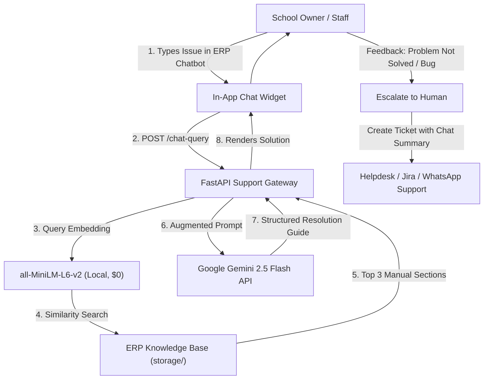
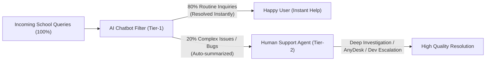

# 🏫 School ERP Support Chatbot - Cost Estimation & Architecture Blueprint

## 1. Executive Summary

This document presents a strategic cost estimation and architectural plan for implementing an **AI-Powered Tier-1 Support Chatbot** for a **School ERP (SaaS) Platform**.

### Core Objective:

To eliminate 70–80% of routine human support calls from School Owners, Principals, Accountants, and Teachers by resolving configuration, how-to, and operational questions instantly through a RAG-based AI assistant, while automatically escalating genuine technical bugs to human agents.

---

## 2. Target Audience & Query Taxonomy

Unlike student-facing applications, this system serves **School Administrative Staff**:

| User Persona                 | Typical Inquiries                                                        | Resolution Method                             |
| :--------------------------- | :----------------------------------------------------------------------- | :-------------------------------------------- |
| **School Owner / Principal** | Fee collection summary, report card templates, academic year setup       | RAG (User Manuals & Settings Guides)          |
| **School Accountant**        | Fee concession rules, receipt reprints, tally export, GST invoice issues | RAG + Step-by-step workflow navigation        |
| **Teachers / Staff**         | Attendance bulk upload, marks entry validation, timetable configuration  | RAG (Module documentation & Excel guidelines) |
| **Transport In-Charge**      | Route mapping, driver assignment, GPS tracker sync                       | RAG + Troubleshooting checklist               |

---

## 3. Token Economics & Cost per Query

### 3.1. Token Usage Profile per Support Query

- **User Inquiry:** ~50 tokens _(e.g., "Excel upload for Class 5 attendance showing invalid date format error")_
- **ERP Knowledge Base Context:** ~1,200 tokens _(Top 2-3 matched documentation paragraphs)_
- **System Persona & Boundary Rules:** ~200 tokens _(Role: ERP Senior Support Specialist)_
- **Conversation History:** ~250 tokens _(Last 1-2 dialogue turns)_
- **Total Input Tokens ($T_{in}$):** **~1,700 tokens**
- **AI Solution Output ($T_{out}$):** **~200 tokens** _(Clear, numbered step-by-step instructions)_

### 3.2. Unit Cost Formula (Google Gemini 2.5 Flash)

$$\text{Input Cost} = \frac{1,700}{1,000,000} \times \$0.075 = \$0.0001275$$
$$\text{Output Cost} = \frac{200}{1,000,000} \times \$0.300 = \$0.0000600$$
$$\mathbf{\text{Total Cost per Query}} = \mathbf{\$0.0001875}\text{ (approx. }\mathbf{₹0.015}\text{ / 1.5 paise)}$$

---

## 4. Multi-School Scale Projections Matrix

_(Assuming an average of 4–5 support queries per school per business day)_

| Client Base (Schools) | Daily Support Queries | Monthly Queries | Monthly AI Cost (USD) | Monthly AI Cost (INR ₹)\* | Tier Status                      |
| :-------------------- | :-------------------- | :-------------- | :-------------------- | :------------------------ | :------------------------------- |
| **10 – 25 Schools**   | 50 – 125              | 1,500 – 3,750   | **$0.00**             | **₹0.00**                 | **100% Free** (Gemini Free Tier) |
| **50 Schools**        | ~200                  | 6,000           | **$0.00**             | **₹0.00**                 | **100% Free** (Gemini Free Tier) |
| **100 Schools**       | ~400                  | 12,000          | **$2.25**             | **₹186.75**               | Pay-as-you-go                    |
| **250 Schools**       | ~1,000                | 30,000          | **$5.62**             | **₹466.46**               | Pay-as-you-go                    |
| **500 Schools**       | ~2,000                | 60,000          | **$11.25**            | **₹933.75**               | Pay-as-you-go                    |
| **1,000 Schools**     | ~4,000                | 120,000         | **$22.50**            | **₹1,867.50**             | Pay-as-you-go                    |

_\*Exchange rate assumed: 1 USD ≈ 83 INR._

---

## 5. Return on Investment (ROI) vs. Human Support

| Comparison Metric                             | Traditional Support Team (₹8k–₹15k / rep)             | AI Tier-1 Support Chatbot                         |
| :-------------------------------------------- | :---------------------------------------------------- | :------------------------------------------------ |
| **Salary per Executive**                      | **₹8,000 – ₹15,000 / month** (+ desk/phone overheads) | **₹0 – ₹500 / month** (Total operational cost)    |
| **Handling Capacity**                         | 30 – 50 calls/day (~1,000 calls/month per rep)        | **Unlimited concurrent users**                    |
| **Cost for 100 Schools** (~12,000 queries/mo) | Needs **8–10 Reps** = **₹80,000 – ₹1,20,000 / month** | **₹186 / month** (Gemini 2.5 Flash)               |
| **Working Hours**                             | 9:00 AM – 6:00 PM (Monday–Saturday)                   | **24x7 / 365 Days** (Evenings & Sundays included) |
| **Response Latency**                          | 2 – 15 minutes (Queue hold / busy lines)              | **< 2 seconds (Instant)**                         |
| **Repetitive How-To Deflection**              | High human fatigue & turnover                         | **80% Deflection Rate**                           |
| **Training & Onboarding**                     | 2–4 weeks every time a rep leaves                     | Instant (Update markdown document / RAG)          |

| **Scalability** | Requires hiring more staff per 50 schools | **Zero incremental overhead** |

---

## 6. End-to-End Operational Architecture

---

## 7. Pros & Cons Analysis (फ़ायदे और नुक़सान)

### 🟢 Fayde (Pros & Advantages)

1. **80% Repetitive Load Reduction for Support Team:**
   - Routine queries ("Password reset kahan se hoga?", "Receipt format kaise badlein?") AI handle kar leta hai. Human executives ko din me 50 baar ek hi baat repeat nahi karni padti.
2. **24x7 / 365 Days Instant Availability:**
   - School staff aksar shaam ko 7 PM ke baad ya Sunday ko fee closing aur report card banate hain jab support office band hota hai. AI unhe raat ko bhi 2 second me guide karta hai.
3. **Zero Wait Time (< 2 Seconds):**
   - Call par wait karne ya ticket reply ke liye ghanto rukne ki zarurat nahi.
4. **Hinglish & Multi-language Support:**
   - School accountants aur teachers Hindi, English, ya Hinglish me sawal puchhein, AI natural bhasha me step-by-step samjha deta hai.
5. **Human Agent ke liye Pre-prepared Context:**
   - Jab query human ke paas aati hai, to agent ko staff ki poori history aur error summary pehle se pata hoti hai (5-10 minute ka call time bach jata hai).

---

### 🔴 Nukshan & Limitations (Cons & Challenges)

1. **Actual Code Bugs & Database Errors Solve Nahi Kar Sakta:**
   - Agar ERP me 500 Server Error aaya hai ya database me data corrupt hua hai, to AI code fix nahi kar sakta; uske liye developer/human support hi chahiye.
2. **Outdated Documentation Risk:**
   - Agar ERP me koi naya update aaya aur manual update nahi hua, to AI purana tarika bata sakta hai.
3. **Remote Desktop (AnyDesk) Support Ki Kami:**
   - Kuch non-tech-savvy school staff hote hain jo padh kar nahi kar paate aur kehte hain _"Aap AnyDesk pe leke khud kar do"_. Yeh sirf human kar sakta hai.
4. **Lack of Human Empathy:**
   - Gussa ya panic-driven school principal ko emotionally handle karna aur trust build karna sirf human kar sakta hai.

---

## 8. Detailed Comparison: AI Chatbot vs. Human Support

| Feature / Scenario                      | AI Chatbot (Tier-1 Shield)              | Human Support Executive                       | Winner / Best Role |
| :-------------------------------------- | :-------------------------------------- | :-------------------------------------------- | :----------------- |
| **Simple "How-to" Questions**           | Instant step-by-step guide in 2 seconds | Takes 5-10 mins on call explaining clicks     | **AI Chatbot**     |
| **Availability**                        | 24x7, Nights & Weekends                 | 9:30 AM – 6:30 PM (6 days)                    | **AI Chatbot**     |
| **Concurrent Handling**                 | 500+ users simultaneously               | 1 call at a time                              | **AI Chatbot**     |
| **Complex Bugs & Database Mismatch**    | Cannot diagnose root-cause code         | Can investigate logs & escalate to Devs       | **Human Support**  |
| **Remote Support (AnyDesk/TeamViewer)** | Not possible                            | Hands-on mouse control & resolution           | **Human Support**  |
| **Relationship & Client Retention**     | Transactional & technical               | Builds personal rapport with School Owners    | **Human Support**  |
| **Employee Fatigue & Burnout**          | Never gets tired, always polite         | High burnout answering the same FAQ 50x daily | **AI Chatbot**     |

---

## 9. The Ideal Philosophy: "AI + Human Synergy" (Load Reduction, Not Replacement)

> **Core Philosophy:** Hum human employees ko replace nahi kar rahe, balki unhe **superpower** de rahe hain taaki wo boring repetitive calls se bach sakein aur high-value client relationships par focus karein.

---

## 10. Implementation Recommendations

1. **Ingest Existing Knowledge Assets:**
   - Index your existing ERP user manuals, video transcripts, release notes, and common customer FAQs into the RAG vector store.
2. **Deflection First, Escalation Second:**
   - Let the bot resolve how-to issues directly.
   - For unsolved issues or bug keywords, trigger an automated ticket creation API with a synthesized summary of what the user attempted.
3. **Embed Local Vectors:**
   - Keep vector embeddings running in-process via `sentence-transformers/all-MiniLM-L6-v2` to maintain $0.00 vector billing and zero API rate limits.
