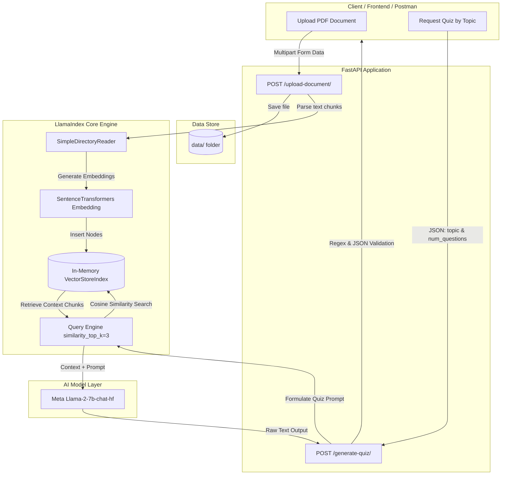

# RAG Quiz Generator Backend - Architecture & Workflow Documentation

## 1. Project Overview (प्रोजेक्ट का संक्षिप्त विवरण)
Yeh backend ek **RAG (Retrieval-Augmented Generation)** based AI Quiz Generator hai.
Iska main kaam user se PDF documents lena, unhe vector format me encode karke index karna, aur user ke diye gaye topic ke basis par AI se multiple-choice quiz questions (MCQs) generate karwana hai.

---

## 2. Tech Stack & Technologies Used

| Component | Technology | Description |
| :--- | :--- | :--- |
| **Backend Framework** | FastAPI | High-performance asynchronous Python web framework |
| **Server Engine** | Uvicorn | ASGI web server to serve FastAPI |
| **RAG Framework** | LlamaIndex | Document parsing, embedding, vector store & query engine |
| **LLM Model** | Meta Llama-2-7b-chat-hf | Text generation model for producing questions |
| **Embeddings Model** | `sentence-transformers/all-mpnet-base-v2` | Converts text chunks into dense vector representations |
| **Model Quantization** | BitsAndBytes (8-bit) | Reduces GPU memory requirement for local inference |
| **Data Validation** | Pydantic v2 | Request/Response schema validation |
| **Package Manager** | `uv` | Ultra-fast Python package installer & resolver |

---

## 3. Directory Structure

```plaintext
quiz-rag-backend/
├── app/
│   ├── api/
│   │   ├── __init__.py
│   │   └── routes.py         # API Endpoints (/upload-document, /generate-quiz)
│   ├── core/
│   │   ├── __init__.py
│   │   └── engine.py         # LlamaIndex setup, LLM, Embeddings, VectorStore
│   ├── schemas/
│   │   ├── __init__.py
│   │   └── quiz.py           # Pydantic schemas (QuizRequest)
│   ├── __init__.py
│   └── main.py               # FastAPI App initialization & Lifespan/Startup
├── data/                     # Uploaded PDF files store yahan hote hain
├── doc/                      # Documentation and notes
│   └── SYSTEM_FLOW.md        # Complete System Workflow Doc
├── .env                      # API tokens & secrets (e.g., HF_TOKEN)
├── .env.example              # Template for environment variables
├── pyproject.toml            # Project dependencies & configurations
└── uv.lock                   # Lockfile for reproducible environment
```

---

## 4. End-to-End System Flow Diagram



---

## 5. Step-by-Step Execution Lifecycle

### Phase 1: Application Startup (`main.py` -> `engine.py`)
1. User command run karta hai: `uvicorn app.main:app --reload` ya `python -m app.main`.
2. `main.py` trigger karta hai `@app.on_event("startup")` -> `engine.initialize_rag()`.
3. `initialize_rag()` ke andar:
   - Embedding model load hota hai: `sentence-transformers/all-mpnet-base-v2`.
   - `BitsAndBytesConfig(load_in_8bit=True)` ke saath `meta-llama/Llama-2-7b-chat-hf` Hugging Face se fetch kiya jata hai.
   - Global `Settings` update hoti hain (`chunk_size=1024`, `chunk_overlap=100`).
   - `data/` directory check hoti hai. Agar pehle se koi PDF files hain, toh unka `VectorStoreIndex` ready hota hai.
   - `query_engine` create hota hai with `similarity_top_k=3`.

---

### Phase 2: Document Upload (`POST /upload-document/`)
1. **Endpoint**: `http://127.0.0.1:8000/upload-document/`
2. **Input**: File upload (`.pdf` only).
3. **Execution**:
   - Validation hoti hai ki file `.pdf` format me hai ya nahi.
   - File ko `data/<filename>.pdf` me save kiya jata hai.
   - `SimpleDirectoryReader` file ko read karke text documents me parse karta hai.
   - `engine.update_index(new_docs)` call hota hai:
     - Document ke chunks bante hain.
     - Embedding model chunks ke vector embeddings generate karta hai.
     - Vectors `VectorStoreIndex` me dynamically inject ho jate hain.
4. **Response**:
   ```json
   {
     "message": "Successfully uploaded and indexed sample.pdf",
     "chunks_added": 4
   }
   ```

---

### Phase 3: Quiz Generation (`POST /generate-quiz/`)
1. **Endpoint**: `http://127.0.0.1:8000/generate-quiz/`
2. **Input Payload**:
   ```json
   {
     "topic": "Machine Learning Supervised Algorithms",
     "num_questions": 3
   }
   ```
3. **Execution**:
   - Check kiya jata hai ki `engine.query_engine` ready hai ya nahi.
   - Ek structured prompt taiyar kiya jata hai:
     - Model ko explicitly JSON format me output dene ka rule diya jata hai (`question`, `options`, `correct_answer`, `explanation`).
   - `query_engine.query(quiz_prompt)` execute hota hai:
     1. Topic ke according vector index se sabse relevant top 3 chunks nikale jate hain (**Retrieval**).
     2. Context aur Quiz Prompt ko milakar LLM ke paas bheja jata hai (**Augmented Generation**).
   - LLM ke raw output me se Regex (`re.search(r'\[.*\]', raw_output, re.DOTALL)`) ke jariye valid JSON array extract kiya jata hai.
4. **Output Response**:
   ```json
   {
     "status": "success",
     "data": [
       {
         "question": "What is the primary goal of Supervised Learning?",
         "options": [
           "To find hidden patterns without labels",
           "To map input features to known target labels",
           "To maximize rewards in an environment",
           "To compress data dimensions"
         ],
         "correct_answer": "To map input features to known target labels",
         "explanation": "Supervised learning algorithms are trained on labeled datasets."
       }
     ]
   }
   ```

---

## 6. Current Issues & Important Points (Zaroori Baatein)

### 1. Gated Model Approval (`meta-llama/Llama-2-7b-chat-hf`)
- Error jo abhi terminal me dikha:
  `Your request to access model meta-llama/Llama-2-7b-chat-hf is awaiting a review from the repo authors.`
- **Reason**: Llama-2 ek gated model hai. Hugging Face par token lagane ke baad Meta ki team se approval aane tak yeh download nahi ho sakta.

### 2. Heavy Local Hardware Requirements
- Local Llama-2-7b model lagbhag **13 GB** download space leta hai.
- Iske liye **NVIDIA CUDA GPU (VRAM 8GB+)** chahiye.
- CPU par yeh model kaafi slow chalta hai ya memory out-of-bounds error deta hai.

---

## 7. Recommended Future Improvements

1. **Cloud LLM API Integration (Groq / Gemini / OpenAI)**:
   - Local model download karne ke badle **Groq API** (Llama 3.3, 100% Free & 500ms speed) ya **Google Gemini API** use karke system ko bina GPU ke fast banaya ja sakta hai.
2. **FastAPI Lifespan Context Manager**:
   - `main.py` me `@app.on_event("startup")` deprecate ho chuka hai; use modern `@asynccontextmanager` Lifespan me shift karna chahiye.
3. **Persistent Vector Store**:
   - Abhi index memory me rehta hai. Iske badle **ChromaDB** ya **Qdrant** use karne se server restart hone par baar-baar re-indexing nahi karni padegi.
